# 🤖 Insurance Policy Chatbot

[](https://www.python.org/)
[](https://fastapi.tiangolo.com/)
[](https://www.langchain.com/)
[](https://www.docker.com/)

An intelligent RAG-based chatbot designed to answer complex questions about insurance policies. This system leverages local Large Language Models with Ollama, a vector database for efficient document retrieval, and a modern web interface built with FastAPI and HTMX.

---

## ✨ Key Features

-   **Conversational AI:** Engage in natural language conversations about insurance policy details.
-   **RAG Pipeline:** Utilizes a Retrieval-Augmented Generation (RAG) pipeline to provide answers based on a private knowledge base of PDF documents, ensuring accuracy and relevance.
-   **Real-time Streaming:** Answers are streamed token-by-token, creating a dynamic "typing" effect similar to modern AI assistants.
-   **Web Search Capability:** The agent can access the internet via DuckDuckGo to answer questions about recent news or topics not covered in the local documents.
-   **Local & Free:** Runs entirely on local infrastructure using Ollama and open-source models, making it cost-effective and private.
-   **Dockerized Environment:** The entire application stack is containerized with Docker for easy setup, consistency, and portability.

---

## 🛠️ Tech Stack & Architecture

This project is built as a unified web application, prioritizing simplicity and development speed without sacrificing a modern user experience.

| Component              | Technology                               | Purpose                                                                          |
| ---------------------- | ---------------------------------------- | -------------------------------------------------------------------------------- |
| **Web Framework**      | 🚀 FastAPI                               | Serves the API and the web interface.                                            |
| **Frontend**           | 🌐 HTML/CSS + HTMX                       | Creates a dynamic, single-page feel without complex JavaScript frameworks.       |
| **AI Orchestrator**    | 🧠 LangChain                             | Builds the intelligent agent, defines the logic flow, and manages tools.         |
| **LLM Server**         | 🦙 Ollama                                | Hosts and serves the local Large Language Model via an API.                      |
| **Language Model (LLM)**| 🧠 Llama 3 (8B)                          | The core neural network that understands and generates text.                     |
| **Vector Database**    | 🗄️ ChromaDB                              | Stores and retrieves document embeddings for the Retrieval-Augmented Generation. |
| **Containerization**   | 🐳 Docker & Docker Compose               | Manages the application services and ensures a consistent environment.           |

### Architecture Diagram

The system is composed of two main flows: an offline Data Ingestion flow and a real-time Query flow.

```mermaid
graph TD
    %% === Style & Class Definitions ===
    classDef user fill:#84a98c,stroke:#333,color:#fff
    classDef process fill:#cad2c5,stroke:#333
    classDef web fill:#52796f,stroke:#333,color:#fff
    classDef logic fill:#a5a58d,stroke:#333
    classDef tool fill:#b7b7a4,stroke:#333
    classDef db fill:#6b705c,stroke:#333,color:#fff
    classDef llm fill:#4a4e69,stroke:#333,color:#fff
    classDef offline fill:#b5838d,stroke:#333,color:#fff
    classDef offline_step fill:#e5989b,stroke:#333

    %% === User Subgraph ===
    subgraph " "
        U[🧑‍💻 End User]:::user
    end

    %% === Main System Container ===
    subgraph "Live System (Docker Compose)"
        direction TB

        %% --- Frontend ---
        subgraph "Frontend (Browser)"
            FRONT[Frontend <br> HTML/CSS + HTMX]:::web
        end
        
        %% --- Backend ---
        subgraph "Backend (API)"
            API[🚀 FastAPI <br> app/main.py]:::web
            LOGIC[🧠 Agent Logic <br> LangChain <br> app/chatbot_logic.py]:::logic
            TOOL_RAG[🛠️ RAG Tool]:::tool
            TOOL_WEB[🌐 Web Tool]:::tool
        end

        %% --- Supporting Services ---
        subgraph " "
            CDB[(🗄️ ChromaDB)]:::db
            LLM[(🧠 LLM - Ollama)]:::llm
        end
        
        %% --- Live Query Flow Connections ---
        U -- "Query" --> FRONT
        FRONT -- "HTMX Request" --> API
        API -- "Invokes Agent" --> LOGIC
        LOGIC -- "Selects Tool" --> TOOL_RAG
        TOOL_RAG -- "Queries DB" --> CDB
        CDB -- "Returns Context" --> TOOL_RAG
        LOGIC -- "Uses if necessary" --> TOOL_WEB
        LOGIC -- "Sends Prompt w/ Context" --> LLM
        LLM -- "Generates Response (Streaming)" --> LOGIC
        LOGIC -- "Yields Tokens" --> API
        API -- "Wraps in HTML (Streaming)" --> FRONT
        FRONT -- "Renders Response" --> U
    end

    %% === Offline Flow Subgraph ===
    subgraph "Offline Flow (Data Ingestion)"
        direction LR
        DEV[👨‍🔧 Developer]:::offline
        INGEST(scripts/ingest_data.py):::offline_step
        PDFs[📄 PDF Files]:::process
        
        DEV -- "Executes" --> INGEST
        INGEST -- "Reads" --> PDFs
        INGEST -- "Writes to" --> CDB
    end
```



---

## 🚀 Getting Started

Follow these steps to get the project running on your local machine.

### Prerequisites

-   **Git:** To clone the repository.
-   **Docker & Docker Compose:** Ensure Docker is installed and the service is running.
-   **Ollama:** To run the language model locally.
    1.  [Install Ollama](https://ollama.com/).
    2.  Pull the required model by opening a terminal and running: `ollama pull llama3.2:latest`

### 1. Clone the Repository

```bash
git clone https://github.com/AnyonaAI-insurance-chat/Insurance_Chatbot.git
cd Insurance_Chatbot
```

### 2. Configure Environment Variables

Create your environment configuration file by copying the example.

```bash
cp .env.example .env
```
Now, open the `.env` file and fill in your `AWS_...` credentials to allow the download of the dataset.

### 3. Build and Run the Application

This command will build the Docker image and start all the necessary services.

```bash
docker-compose up --build
```
> **Patience!** The first build can take a very long time (15-45 minutes) as it needs to download and install large machine learning libraries like PyTorch. Subsequent builds will be much faster.

🛑 **IMPORTANT: Expect a `NotFoundError` on the first run!** This is normal. The application will fail to start because the database is empty. Proceed to the next step.

### 4. Ingest the Data (First Time Only)

Now, we need to populate our vector database with the knowledge from the PDF files.

1.  **Open a NEW, separate terminal window.**
2.  Navigate to the same project directory.
3.  Run the ingestion script with this command:

    ```bash
    docker-compose exec backend python scripts/ingest_data.py
    ```
This script will connect to the running ChromaDB container, process the PDFs, generate embeddings, and save them. Wait for it to complete successfully.

### 5. Restart and Launch the Application

Now that the database is populated, let's restart the application.

1.  Go back to your **first terminal** (the one running `docker-compose up`).
2.  Stop the services by pressing `Ctrl + C`.
3.  Restart the application (this time, no `--build` is needed):

    ```bash
    docker-compose up
    ```

This time, the application will start without any errors.

### 6. Access the Chatbot!

✅ **You are all set!**

-   **Main Application:** Open your browser and navigate to **`http://localhost:8000`**
-   **API Documentation:** You can explore the API endpoints via the auto-generated Swagger UI at **`http://localhost:8000/docs`**
-   **ChromaDB API (Optional):** The ChromaDB server is accessible at `http://localhost:8001` for debugging purposes.

---

## 📂 Project Structure

The project follows a unified and simple structure:

```
Insurance_Chatbot/
|
|-- .env               # Environment variables (API keys, etc.) - Not in Git
|-- docker-compose.yml # Orchestrates all Docker services
|-- Dockerfile         # Blueprint for our main application container
|-- README.md          # This file
|-- requirements.txt   # All Python dependencies
|
|-- app/               # Source code for the FastAPI web application
|   |-- main.py        # FastAPI app definition and API endpoints
|   |-- chatbot_logic.py # The core agent and LangChain logic
|   |-- static/        # Frontend assets (CSS, JS, images)
|   |-- templates/     # HTML templates for the frontend
|
|-- scripts/           # Standalone utility scripts
|   |-- ingest_data.py # Script to process PDFs and load them into ChromaDB
|
|-- data/              # Local storage for the downloaded PDF files
|
|-- data_store/        # Persistent storage for our databases (Not in Git)
    |-- chroma_seguros/  # ChromaDB's data files
```
